

# 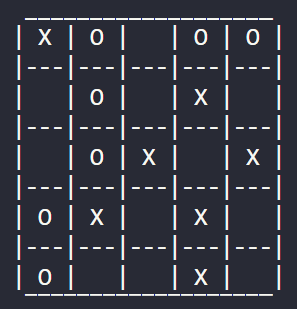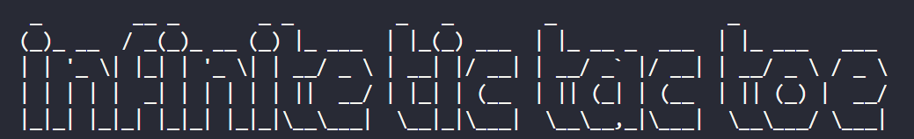

## 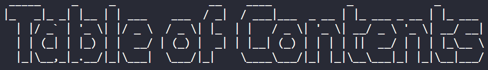 

📚 Table of Contents

1. [📖 About The Project](#about_the_project)
    - [Summary](#summary)
    - [Why?](#why?)
2. [🎮 Play Modes](#play_modes)
    - [👥 2x Player](#2x_player)
    - [👤🎯 Easy Mode](#easy_mode)
    - [👤⚔️ Hard Mode](#hard_mode)
3. [👾 How to Play?](#how_to_play)
3. [🔧 Built With](#built_with)
4. [❔ Getting Started](#getting_started)
    - [Prerequisites](#prerequisites)
    <!-- - [Installation](#installation) -->
5. [📧 Contact](#contact)

## 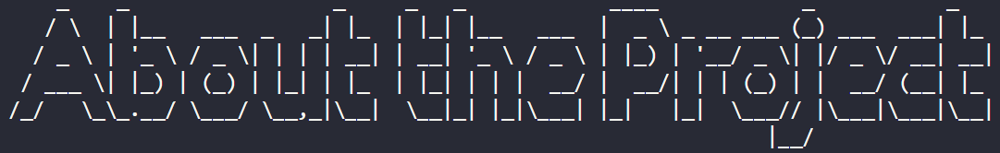

### Summary:
Create any size game of tic tac toe! Play against a friend or the computer! This program has been designed so that, the board formatting, winner & stalemate checks, and the computer player placement priority, are all automated. In theory the game can scale to any size and the automated logic will still work.
> for sanity board size has been limited to 10x10.

### Why?
I started with a simple Tic Tac Toe project and wanted to try to automate all of the logic for the game and as an example make it scalable, as well as adhere to best practices whilst learning, such as error handling, test automation, clean code, type hinting & documentation, OOP and string formatting. Where usually modules could be used in place I have written my own functions for the sake of learning specific concepts.

**Design Automated Logic:**
- Formatting game board to any size
- Winner and stalemate condition checks
- Computer logic for placement priority

**focus on:**
- Error handling
- Clean code approaches
- Type hinting and Docstrings
- Automated unit testing with Pytest - *(switch to test branch to see test files)*
- OOP approach and inheritance

**Modules:** limited use to focus on learning practices 
- <a href= 'https://pypi.org/project/pyfiglet/'>Pyfiglet</a> to print the game logo and create this documents headings
- Random - the inbuilt module, used to generate random placements when the computer player is in easy mode, or can't find a best placement option when in hard mode!  

## 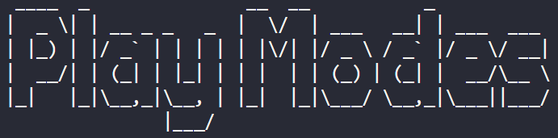

### 👥 2x player
Two player mode where the players can play against each other on a board of their chosen size

### 👤🖥️🎯 Easy mode
Against the computer: In most cases the user should win...

The computer will place it's token at a random valid board location

### 👤🖥️⚔️ Hard mode

Against the computer: In most cases hard mode should result in a stalemate...

The computer is designed to always make the best move to progress its own win, unless the player is closer to progressing, or winning, in which case the computer will make its best move to block them.

The computer will adhere to the following order of operation:
    
    for the size of the board in reverse:
        1. for each column, row, and both diagonals
            try to make the winning/best progress move
        2. for each column, row, and both diagonals
            try to prevent the player from winning/block player progression

    if no priority criteria is met:
        choose a random placement

 **generate priority arguments to be passed into the consider function...**
 - Generate all arguments for each: row, column, and both diagonals
   - first for the best win/progress move
   - then for the best player prevention move

**run all generated priority arguments on the consideration function in order...**
- Pass in the generated priority arguments into the consider function
    - if any of the priority requirements are met the function will return a placement location

> NOTE: *play modes do not affect the game board size, this is an additional feature*

## 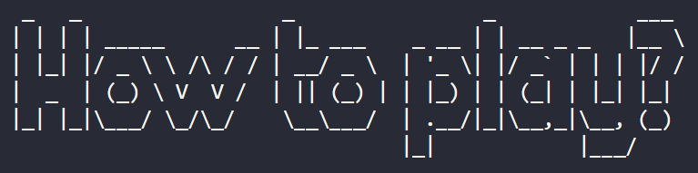

### Game example:
---
---

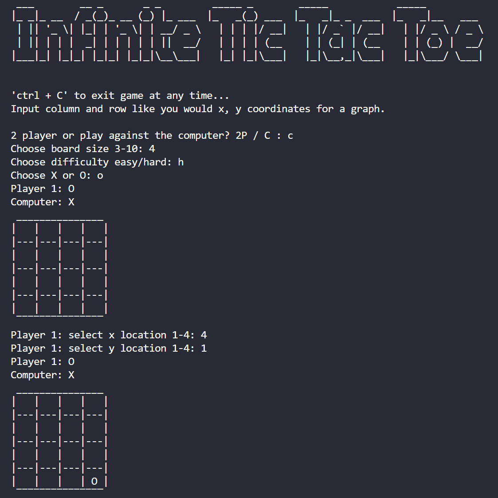

---
---

### Board size examples:

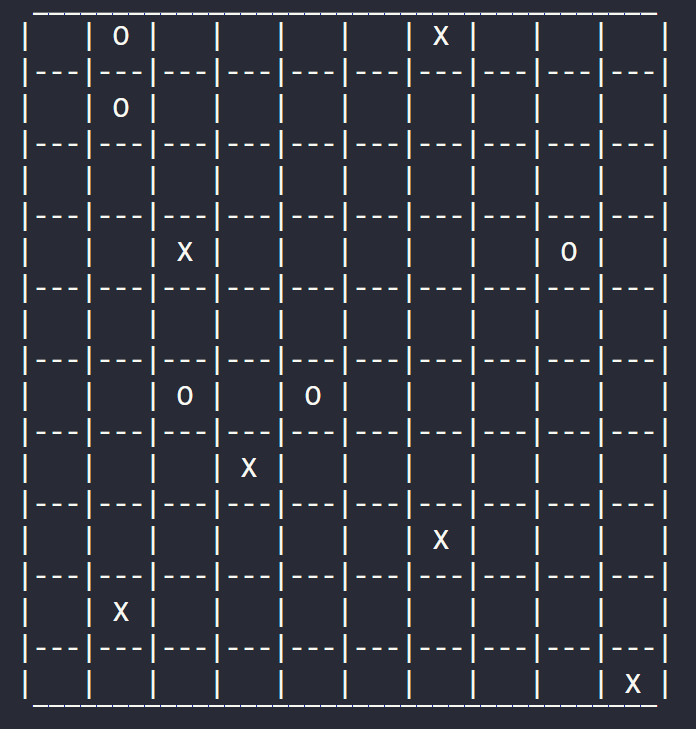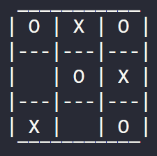

## 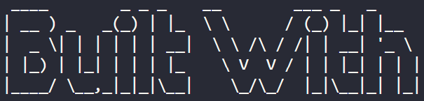
- 🐍 Python
    - <a href= 'https://pypi.org/project/pyfiglet/'>Pyfiglet</a> for README.md text and game logo
- 💠 Visual Studio Code

## 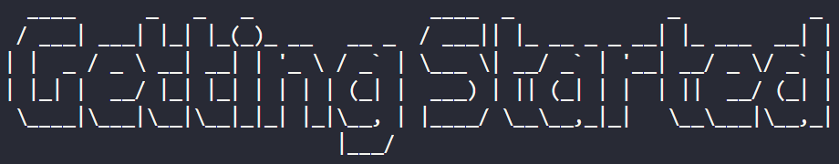

### Prerequisites

packages

[Python](https://www.python.org/downloads/)

    Download Python3 

## 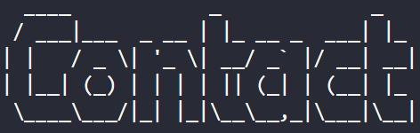

###  Creator: Rachael Lampard-France

Project Link - https://github.com/rachaellampardfrance/Infinite_TicTacToe

[return to top](#top)